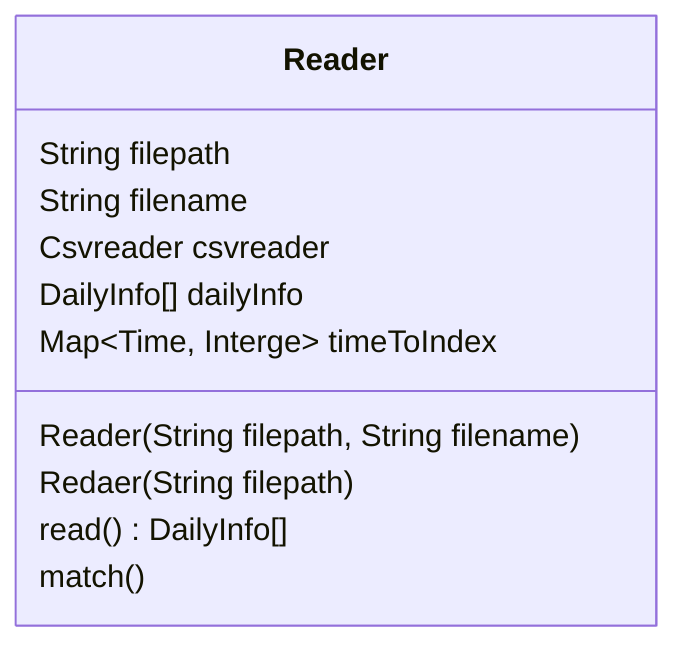
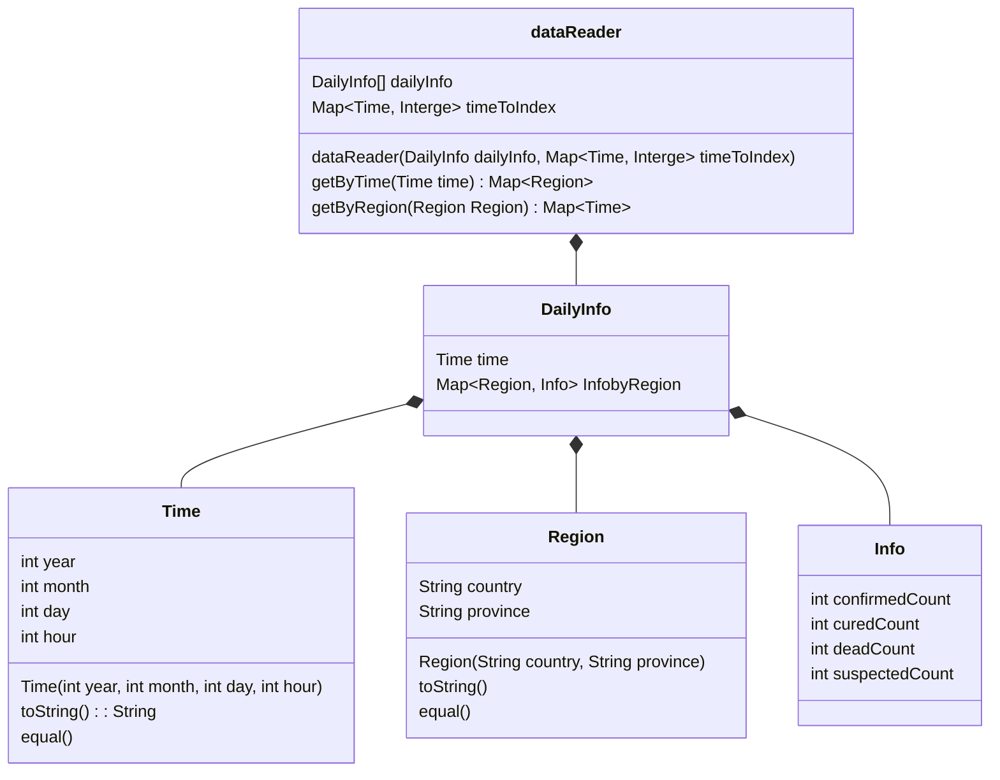

# UCAS Java Project

本仓库用于完成课程作业

- [ ] I/O
- [ ] Data
- [ ] GUI


## 数据说明

DXYArea.csv

数据来源：[BlankerL/DXY-COVID-19-Data: 2019新型冠状病毒疫情时间序列数据仓库 | COVID-19/2019-nCoV Infection Time Series Data Warehouse (github.com)](https://github.com/BlankerL/DXY-COVID-19-Data)

该.csv文件包含了从新冠疫情爆发至今的各个地区每日的确诊人数、治愈人数、死亡人数的变化情况，选择性读取表格中以下数据完成Project

| 表头           | 包含信息         |
| :------------- | ---------------- |
| continent      | 州               |
| country        | 国家             |
| province       | 省份             |
| confirmedCount | 总共确诊病例数量 |
| suspectedCount | 当日确诊病例数量 |
| curedCount     | 总共治愈病例     |
| deadCount      | 总共死亡病例     |
| updateTime     | 更新时间         |


## I/O

该模块主要用于读取.csv文件中的新冠疫情数据：

借助依赖csvreader进行csv文件的读取

```Moven
<dependency>       			  
	<groupId>net.sourceforge.javacsv</groupId>
	<artifactId>javacsv</artifactId>
	<version>2.0</version>
</dependency>
```




## Data

该模块主要用于存储读取的数据

采取一次读完.csv文件的方法，将所需的数据一次性存储以供GUI查找

设计class用于存储数据信息及查询信息




## GUI

该模块主要用于展示读取的数据

使用SwingX与JfreeChart依赖编写界面


### 图表一

输入日期，显示当日中国各省份的新冠疫情确证病例


### 图表二

输入具体地区，显示该地区的新冠疫情的确证病例、治愈病例、死亡病例随时间的变化情况